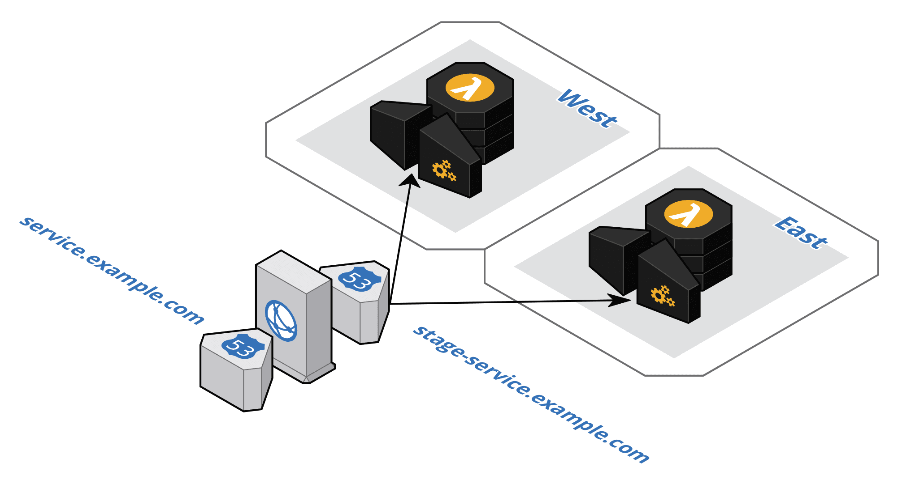

# serverless-multi-region-plugin

[](https://travis-ci.com/unbill/serverless-multi-region-plugin)

TLDR;
This plugin adds resources to configure API Gateway regional endpoints for the regions you specify and a global endpoint
in front of a CloudFront installation to front the regional APIs.

This plugin was forked from serverless-multi-regional-plugin, enhanced and simplified for a true turn-key experience.

## More details?

This plugin will:

- Set up API Gateways for your lambdas in each region
- Set up a custom domain in each region for the API Gateway and specify the appropriate base path
- Set up a basic HTTPS healthcheck for the API in each region
- Set up Route 53 for failover based routing with failover between regions based on the healthcheck created
- Set up CloudFormation in front of Route 53 failover with TLS 1.2 specified
- Set up Route 53 with the desired domain name in front of CloudFront



## Install plugin:

```
npm install serverless-multi-region-plugin --save-dev
```

## Prerequisites: Create your hosted zone and certificates

Using the diagram above as an example the hosted zone would be for _example.com_ and the certificate would be for _\*.example.com_. Create the same certificate in each region to support the regional endpoints. The global endpoint requires a certificate in the us-east-1 region.

## Configuration

### Minimal configuration

In this configuration, the necessary configuration for certificates and domain names will be derived from the primary domain name.
In addition, default healthchecks will be added for each region. It is assumed that your api has a '/healthcheck' endpoint.
See the Customized Configuration below to change the healthcheck path.

In your serverless.yml:

```
# Set up your plugin
plugins:
  - serverless-multi-regional-plugin

# Add this to the standard SLS "custom" region
custom:
  # Settings used for API Gateway and Route 53
  dns:
    # In this setup, almost everything is derived from this domain name
    domainName: somedomain.example.com

  # Settings used for CloudFront
  cdn:
    # Indicates which CloudFormation region deployment used to provision CloudFront (because you only need to provision CloudFront once)
    region: us-east-1
```

### Customized Configuration

This is the configuration example from the original "serverless-multi-regional-plugin".
It's important to note that all of these settings can be used with the minimal configuration above
and they will override the convention-based settings.

```
# Set up your plugin
plugins:
  - serverless-multi-regional-plugin

# Add this to the standard SLS "custom" region
custom:
  # Settings used for API Gateway and Route 53
  dns:
    domainName: ${self:service}.example.com
    # Explicity specify the regional domain name.
    # This must be unique per stage but must be the same in each region for failover to function properly
    regionalDomainName: ${self:custom.dns.domainName}-${opt:stage}
    # Specify the resource path for the healthcheck (only applicable if you don't specify a healthcheckId below)
    # the default is /${opt:stage}/healthcheck
    healthCheckResourcePath: /${opt:stage}/healthcheck
    # Settings per region for API Gateway and Route 53
    us-east-1:
      # Specify a certificate by its ARN
      acmCertificateArn: arn:aws:acm:us-east-1:870671212434:certificate/55555555-5555-5555-5555-5555555555555555
      # Use your own healthcheck by it's ID
      healthCheckId: 44444444-4444-4444-4444-444444444444
      # Failover type (if not present, defaults to Latency based failover)
      failover: PRIMARY
    us-west-2:
      acmCertificateArn: arn:aws:acm:us-west-2:111111111111:certificate/55555555-5555-5555-5555-5555555555555555
      healthCheckId: 33333333-3333-3333-3333-333333333333
      failover: SECONDARY

  # Settings used for CloudFront
  cdn:
    # Indicates which CloudFormation region deployment used to provision CloudFront (because you only need to provision CloudFront once)
    region: us-east-1
    # Aliases registered in CloudFront
    # If aliases is not present, the domain name is set up as an alias by default.
    # If *no* aliases are desired, leave an empty aliases section here.
    aliases:
      - ${self:custom.dns.domainName}
    # Add any headers your CloudFront requires here
    headers:
      - Accept
      - Accept-Encoding
      - Authorization
      - User-Agent
      - X-Forwarded-For
    # Specify a price class, PriceClass_100 is the default
    priceClass: PriceClass_100
    # Specify your certificate explicitly by the ARN
    # If the certificate is not specified, the best match certificate to the domain name is used by default
    acmCertificateArn: ${self:custom.dns.us-east-1.acmCertificateArn}
    # Set up logging for CloudFront
    logging:
      bucket: example-auditing.s3.amazonaws.com
      prefix: aws-cloudfront/api/${opt:stage}/${self:service}
    # Add the webACLId to your CloudFront
    webACLId: id-for-your-webacl
```

## Deploy to each region

You've got your configuration all set.

Now perform a serverless depoyment to each region you want your Lambda to operate in.
The items you have specified above are set up appropriately for each region
and non-regional resources such as CloudFront and Route 53 are also set up via CloudFormation in your primary region.

You now have a Lambda API with cross-region failover!!!


## Related Documentation

- [Building a Multi-region Serverless Application with Amazon API Gateway and AWS Lambda](https://aws.amazon.com/blogs/compute/building-a-multi-region-serverless-application-with-amazon-api-gateway-and-aws-lambda)
